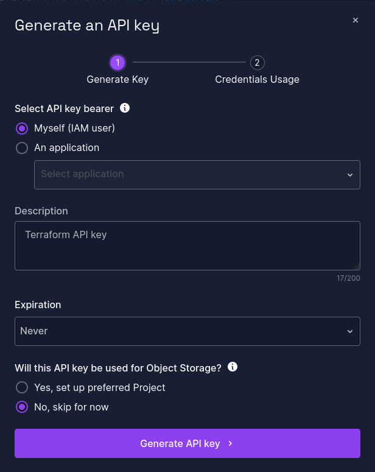
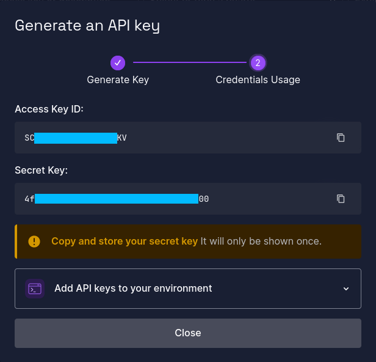

# Scaleway k8s cluster

Useful links:

| Descrption             | Link                                                                                        |
|------------------------|---------------------------------------------------------------------------------------------|
| Provider documentation | https://registry.terraform.io/providers/scaleway/scaleway/latest                            |
| Scaleway IAM Console   | https://console.scaleway.com/iam/api-keys                                                   |
| How to create API keys | https://www.scaleway.com/en/docs/identity-and-access-management/iam/how-to/create-api-keys/ |

## Pre-requisites

* A Scaleway Account
* A Scaleway project
* Scaleway API keys (see _Getting credentials_ step)

## Getting credentials

Credentials can be generated for a Scaleway user in the IAM console : https://console.scaleway.com/iam/api-keys

Create an API Key :

Take note of the generated _Access Key ID_ and _Secret Key_.

## Required env vars

This project needs 2 environment variables in order to be run :

| env            | value                                            |
|----------------|--------------------------------------------------|
| SCW_ACCESS_KEY | The Access Key ID generated at the previous step |
| SCW_SECRET_KEY | The Secret Key generated at the previous step    |

## Running the code

This code manages a Scaleway Kubernetes Cluster on the `fr-par` region. The cluster uses a private network, and has a
dedicated node pool.

### Variables

| Name                                                                     | Description                                            | Type     | Default    | Required |
|--------------------------------------------------------------------------|--------------------------------------------------------|----------|------------|:--------:|
|  [cluster\_name](#input\_cluster\_name) | the name of the cluster to create                      | `string` | n/a        |   yes    |
|  [node\_count](#input\_node\_count)       | number of instances to create in the cluster node pool | `number` | `1`        |    no    |
|  [node\_type](#input\_node\_type)          | the type of node to create in the cluster node pool    | `string` | `"DEV1-M"` |    no    |

### Outputs

| Name                                                                                         | Description                               |
|----------------------------------------------------------------------------------------------|-------------------------------------------|
|  [cluster\_kubeconfig](#output\_cluster\_kubeconfig) | the contents of generated KUBECONFIG file |
